# Training features

Large companies have large computing power, that allows them to set up many experiments. In this way,
for example, testing a large grid of hyperparameters, learning on very large datasets, and even selecting the 
optimal random seed. The vast majority of companies do not have such an opportunity, so they have to go the other way. 
We offer several techniques to improve the generalization of the model. It should improve your models as 
it improves ours.

## 1. Fine-tune BatchNorm

It's a feature allows you to fix your imperfect dataset distribution, which could contains outliers.
Our new approach fix it via running_mean and running_var parameters of BatchNorms.  

### Results

To show, that this feature works, we took face recognition task, especially [pretrained models form insightface repo](https://github.com/deepinsight/insightface/tree/master/recognition/arcface_torch#model-zoo).
For fine-tune we took R100 model, which was trained on glint and corresponding config. 

In first experiment we used ImageNet21k (100 random pictures per class) as out-of-domain data, and we got such results 
on IJB-C dataset:

|  Methods  | 1e-06 | 1e-05 | 0.0001 | 0.001 |  0.01 |  0.1  |
|-----------|-------|-------|--------|-------|-------|-------|
| baseline  | 90.58 | 95.88 | 97.32  | 98.19 | 98.73 | 99.24 |
| finetuned | 92.11 | 96.04 | 97.29  | 98.12 | 98.70 | 99.26 |

As you can see, TPRs on FPR 1e-6 and 1e-5 have increased.

In second experiment instead of real images we generated normally distributed tensors and added them to each training tensor 
(labels doesn't matter, because we don't train model). Results on IJB-C dataset:

|  Methods  | 1e-06 | 1e-05 | 0.0001 | 0.001 |  0.01 |  0.1  |
|-----------|-------|-------|--------|-------|-------|-------|
| baseline  | 90.58 | 95.88 | 97.32  | 98.19 | 98.73 | 99.24 |
| finetuned | 91.63 | 95.94 | 97.22  | 98.12 | 98.68 | 99.22 |

The results are modest then with ImageNet21k, but it also works. The main pros of this method - you can use it without 
searching and downloading new datasets.

Last experiment was with blurring some part of dataset. It doesn't increase metrics on public datasets, but for our previous
release model it works (a slight worse than in first experiment). Results on IJB-C dataset:

|  Methods  | 1e-06 | 1e-05 | 0.0001 | 0.001 |  0.01 |  0.1  |
|-----------|-------|-------|--------|-------|-------|-------|
| baseline  | 90.58 | 95.88 | 97.32  | 98.19 | 98.73 | 99.24 |
| finetuned | 90.49 | 95.89 | 97.30  | 98.15 | 98.72 | 99.23 |

Our released model (which was submitted to NIST) we fine-tuned on ImageNet21k (100 picture per class) + other out-of-domain
public datasets (such as OpenImages, FractalDB-1k, NABirds, etc.). In total, we added 5% such images.


### How to use it in your own training pipeline?

1. Totally freeze your backbone/feature extractor. You can make it by func `finetune_batchnorms.freeze_backbone`

2. Add one of noise type to your dataset (or you can mix it):
    - blur augmentation (you can make it by func `finetune_batchnorms.add_blur_to_transforms`)
    - normal distributed noise (you can make it by func `finetune_batchnorms.add_noise_to_batch`, which expand batch)
    - out-of-domain data (for example, for face recognition you can use any images without faces)

3. Train your pipeline as normal for a few epochs (you can save the intermediate state of backbone, because 
   the running parameters changing fast)

4. Evaluate all saved models due training and select best one

5. [optional] Visualise changes of BatchNorm parameters via [visualisation_utils.py](bn_finetune/visualisation_utils.py)
You can find our example at [visualisation example](bn_finetune/visualisation_example.ipynb).


## 2. Quality Assessment Algorithms(QAA)

Instead of adapting to the imperfect distribution of the dataset, we can detect  images with unusual lighting, orientation, expression, etc. and discard it from further works. To do it, we need model that assign quality [0,100] to image. Then you can throw away images with lowest quality from dataset and improve metrics.

### Results

We took [R100 (trained on Glint360K)](https://github.com/deepinsight/insightface/tree/master/recognition/arcface_torch#model-zoo) mentioned earlier
as backbone for quality estimator. After training, we dropped 4.63% images with lowest qualities from validation (IJB-C) and recalculated metrics. 
As you can see, TPRs have increased on every FPR.

|  Methods  | 1e-06 | 1e-05 | 0.0001 | 0.001 |  0.01 |  0.1  |
|-----------|-------|-------|--------|-------|-------|-------|
| baseline  | 90.58 | 95.88 | 97.32  | 98.19 | 98.73 | 99.24 |
| filtered  | 92.26 | 96.52 | 97.74  | 98.45 | 98.90 | 99.32 |

<details>
<summary> Low quality examples from IJB-C </summary>
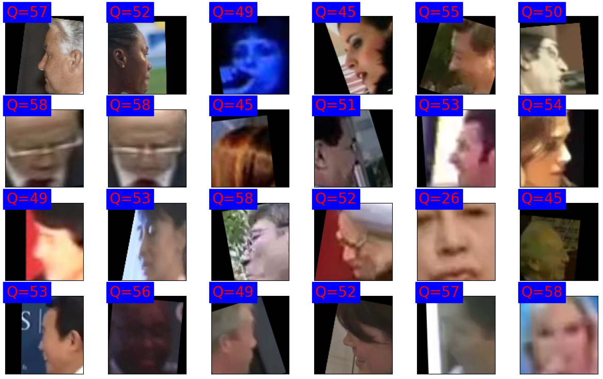
</details>

### How to train your own QAA?

You can check [QAA model training notebook example](qaa/example.ipynb). 
Feel free to use your face recognition model, dataset or feature extraction method.
You must complete these steps:

#### 1. Load the Face Recognition Model.

To train your quality estimator we offer to use [R100 (trained on Glint360K)](https://github.com/deepinsight/insightface/tree/master/recognition/arcface_torch#model-zoo), but you can try use your own model.

#### 2. Load dataset on which model from step 1. was trained and softmax layer weights(class centroids).

To train QAA model you need calculate similarity with class centroid for embedding of every image.
It will be used as ground truth label in future. 

To run example notebook, download [subset of first 15K classes from glint](https://drive.google.com/file/d/1RFvAFTYTBrNpkRgfadZA07FVx8UwV7TM/view) and [related centroids](https://onedrive.live.com/?authkey=%21AFZjr283nwZHqbA&id=4A83B6B633B029CC%215582&cid=4A83B6B633B029CC).
Rank 0 centroids would be enough to 15k subset (each rank contains ~49k classes).

#### 3. Feature engineering and training regressor.

As mentioned earlier, batch normalization layers contain information about training domain. We can collect BN's inputs or running statistics and transform it different ways. For example, we compute variance of every BN's input and compute it's mean and variance.
We extract features for every image from dataset and pass it to CatBoostRegressor, using centroid similarity as ground truth label.

Similarity belongs to [-1,1], but mainly located at [0,1]. We can
clamp regressor's output to [0,1], multiply by 100 and round to int, to get [0,100] value range.

Filtering by quality can improve metrics. Also you can use it in pair
with embeddings, which is demonstrated in the next paragraph.

## 3. Graph-Refined Face Dataset Clustering/Filtering: Combining Face Embeddings with Quality

We can filter dataset using graph-based approach. By combining face embeddings and
QAA scores, this method creates a more accurate graph structure,
using QAA as extra dimension for separation. Then substructures in graph are revealed
using community detection algorithm. This approach offering a more refined 
clustering of face images.

It's a feature that allows you to easily filter face datasets without the hyperparameter selection, providing finer clustering result than traditional methodologies.

You can find example of glint360k filtering in our jupyter notebook [example](dataset_filtering/example.ipynb).

### Results

Our approach offers a visualization of clustering. For visual representation, we employ t-SNE, a popular technique for high-dimensional data visualization.
Red represents noisy pictures, while other colors denote distinct clusters.
Below, you'll find comparison of clustering using DBSCAN and our algorithm, performed on the Glint360K dataset:

<details>

| DBSCAN  | Proposed algorithm | 
| ------- | ------------------ |
| 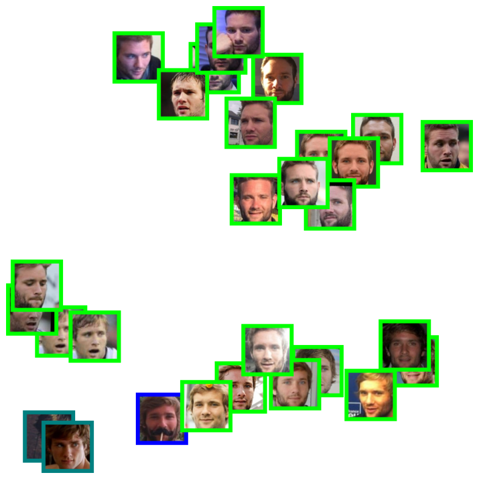 | 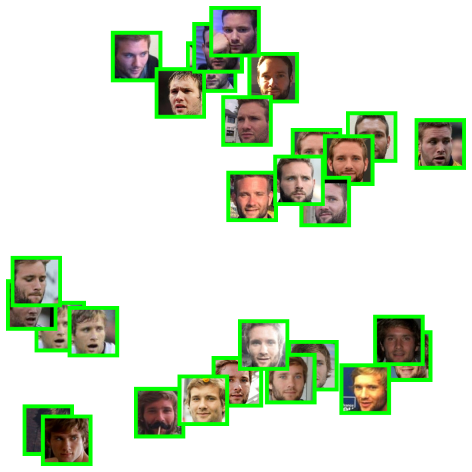 |
| 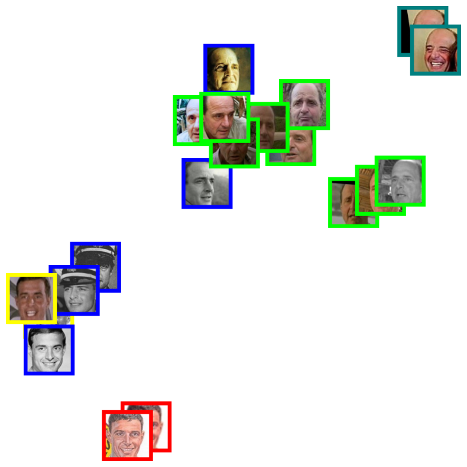 | 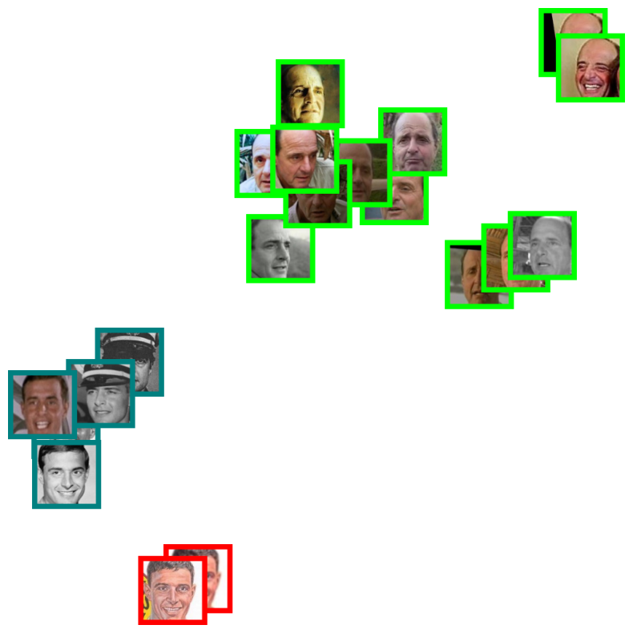 |
| 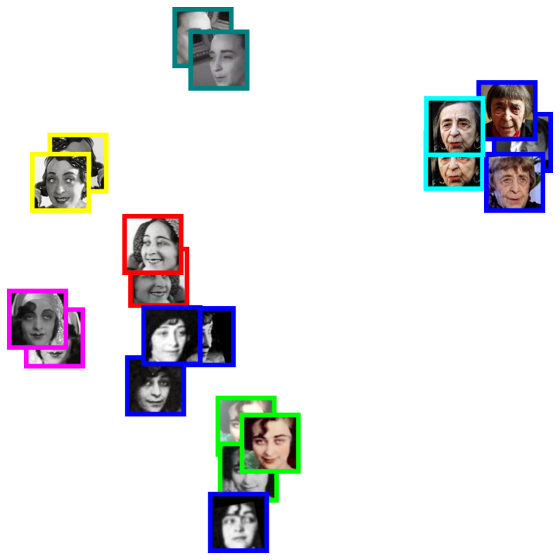 | 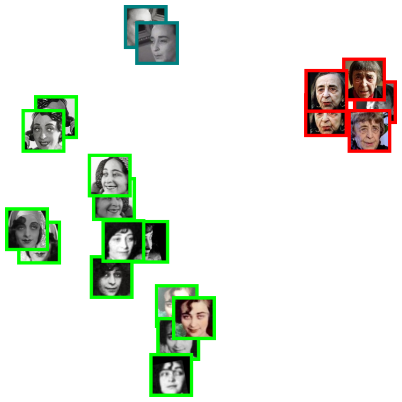 |
| 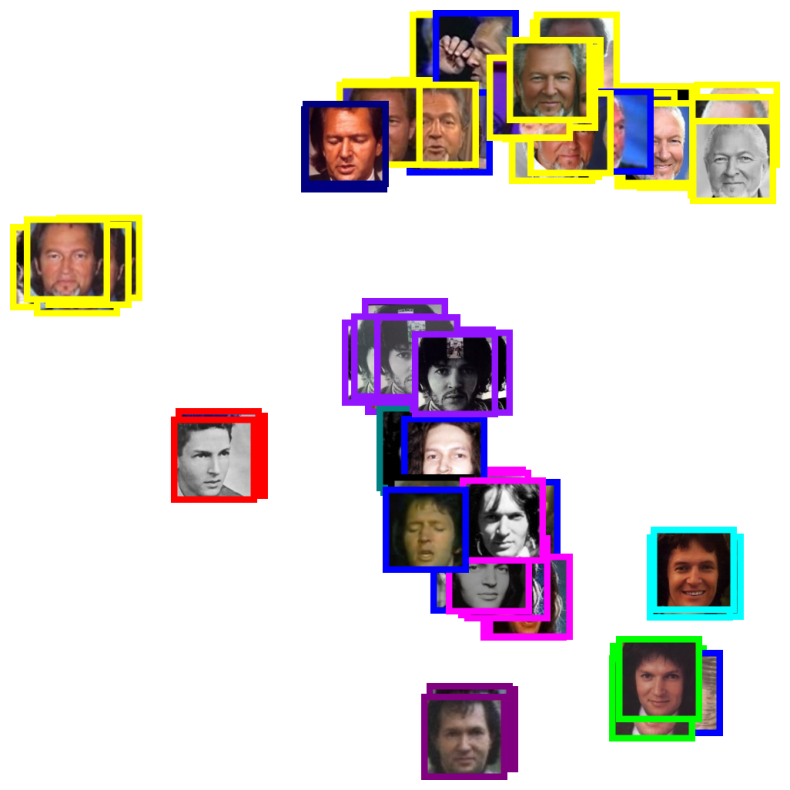 | 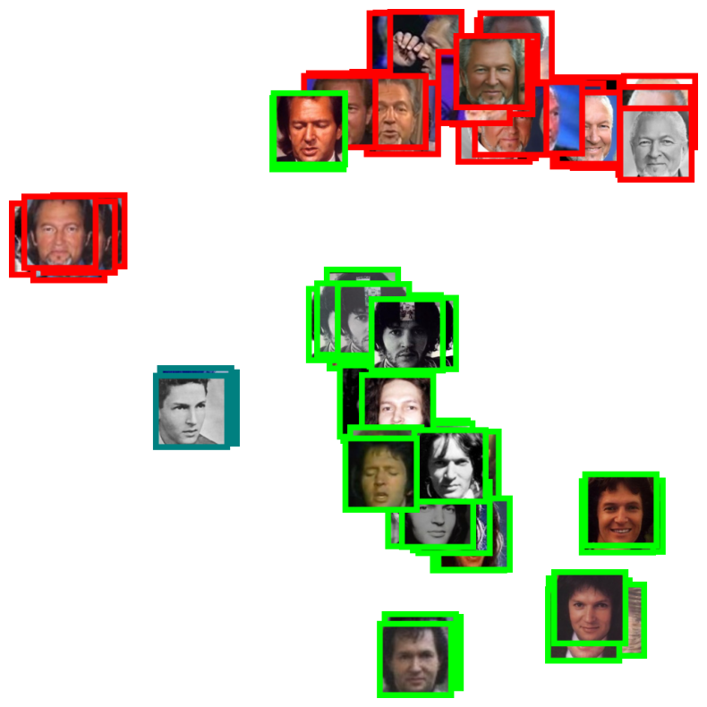 |
| 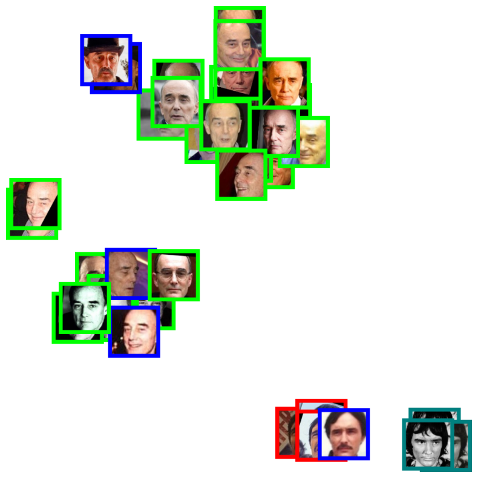 | 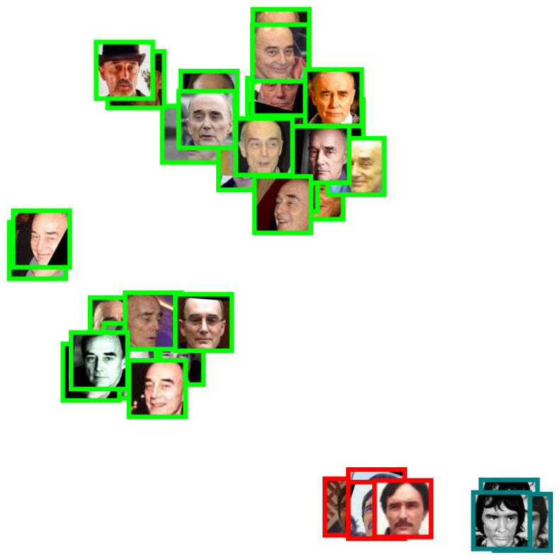 |

</details>

### How to use it for your own dataset?

You can use FaceDatasetFiltering tool, follow steps below.

#### 1. Face Alignment

Before anything else, align the faces in your dataset. We recommend following the face alignment procedure as in InsightFace. 
You can refer to their face alignment utility script [here](https://github.com/deepinsight/insightface/blob/master/python-package/insightface/utils/face_align.py#L27) for a detailed implementation.

This step is required in many approaches, including [QAA training example](qaa/example.ipynb). Glint360K is distributed with alignment already applied,
so we skipped it during QAA training.

#### 2. Load the Face Recognition Model

To perform dataset filtering we suggest you to use [pretrained R200 from out repository](dataset_filtering/iresnet200_weigths.pth). If you want, you can try any other model.

#### 3. Load the Face Quality Assessment Model

This model will help in determining the quality of the faces in your dataset, enabling better filtering results. We suggest you to use model from previous paragraph (with backbone R100 trained on Glint360K).
We made simple wrapper QualityEstimatorPipeline to combine feature extraction
from R100 BNs and CatBoostRegressor.

```python
from qaa.models import BNFeatureExtractor, QualityEstimatorPipeline
from recognition.models.iresnet import iresnet100
qaa_backbone_weights_path = f'../recognition/weights/{model_name}.pth'
qaa_backbone = iresnet100().to(device)
qaa_backbone.load_state_dict(torch.load(qaa_backbone_weights_path))
quality_estimator_weight_path = f"../qaa/weights/{model_name}_qaa.cbm"
quality_estimator = cb.CatBoostRegressor().load_model(quality_estimator_weight_path)

qep = QualityEstimatorPipeline(qaa_backbone, quality_estimator, device=device)
```

#### 4. Initialization

Pass the PyTorch Dataset, the Face Recognition Model, and the Face Quality Assessment Model to the constructor of the FaceDatasetFiltering class:

```python
from face_dataset_filtering import FaceDatasetFiltering
filter_obj = FaceDatasetFiltering(your_dataset, face_recognition_model, face_quality_model, device)
```

#### 5. Filtering the Dataset

Once everything is set up, call the filter_dataset method:

```python
filter_obj.filter_dataset()
```

#### 6. Applying Clustering Results

Post-filtering, the results are saved in the FaceDatasetFiltering.filtering_results attribute. It's structured as a dictionary where the key represents the name of a class, and the value is the clustering results.

To understand the clustering results, consider them analogous to the representation in sklearn. A label of -1 denotes noisy samples. Use this information to further refine, segregate, or clean your dataset.

----

That's it! With these simple steps, you can efficiently filter and refine your face dataset, ensuring optimal quality and precision for downstream tasks.